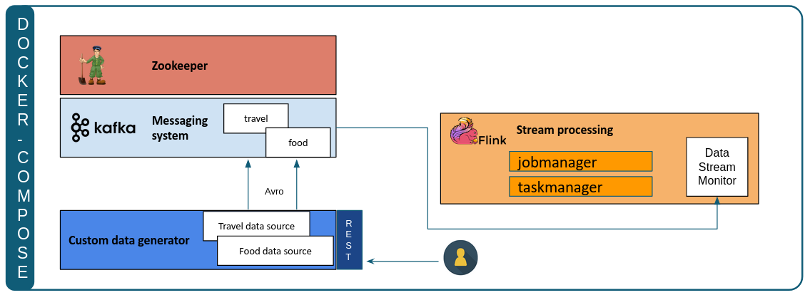

**!! This repository is in an early alpha stage. !!** <br>
    At the current state, it does not yet contain a sufficient test suite.
# Soda-streaming

## Background and project goal
The number of use cases which use some form of real-time data processing has increased drastically over the last decades.
Data is generated at an unprecedented volume, velocity and variety. This brings up the concern of guaranteeing data
quality of these generated streams. To provide a solution for this, this repository contains an automated streaming
data quality monitoring system. This system generates real-time insights on the quality of data and visualizes
it in the Soda Cloud.

The initial scope of the monitor is data residing on messaging systems. The first integration is with Apache Kafka.
Messaging systems are systems which form an intermediary between data producers and data consumers.
As such, they are a good source for data monitoring. 
The system is customizable, generalizable and easily deployable. The user is able to specify which metrics should be
tracked for each stream and, in the future, should be able to define the additional tests that should be done.

Several components are setup to constitute the whole infrastructure in order to have an end-to-end working pipeline:
1. Apache Kafka -> messaging bus
2. Data Ingest -> a component generating avro data and making this data available through Kafka.
3. Stram Monitor -> flink job that is easily configurable to calculate specific data quality metrics.
4. Infrastructure -> docker-compose setup that automatically builds the aforementioned components towards a data quality pipeline.



A more detailed README.md can be found at each specific component folder:
- [streaming-monitor](/streaming-monitor/README.md)
- [data-ingest](/dataingest/README.md)
- [poc-tooling](/poc-tooling/README.md)

## Project structure
```
├── dataingest
│   ├── create_travel_avro.py
│   ├── data
│   │   └── final_travel.json
│   ├── Dockerfile
│   ├── main_pub_kafka.py
│   ├── README.md
│   ├── requirements.txt
│   ├── schemas
│   │   ├── food.avsc
│   │   └── travel.avsc
│   ├── test
│   │   ├── send_post_to_datagen.py
│   │   └── validate_avro_format_from_kafka.py
│   └── utils
│       ├── configurator.py
│       ├── generator.py
│       ├── io.py
│       └── pubsub
├── docs
│   ├── all_metrics_available.png
│   ├── limited_metrics_available.png
│   ├── limited_metrics_with_invalidity_showing.png
│   └── overview-architecture.png
├── LICENSE
├── poc-tooling
│   ├── build-new-jar.sh
│   ├── docker-compose.yml
│   ├── e2edemo.sh
│   ├── README.md
│   ├── specific-scans
│   │   ├── food.yml
│   │   └── travel.yml
│   ├── streaming-monitor.jar
│   └── submit-job.sh
├── README.md
└── streaming-monitor
    ├── pom.xml
    ├── README.md
    └── src
        ├── main
        └── test
```

### Proof of Concept setup: E2E demo

You can choose for this setup to run end-to-end (E2E) automatically running the `e2edemo.sh` script.
```
e2edemo.sh
```
The end to end demo involves 11 consecutive steps in order to showcase the capabilities of the work done so far.
Next to the steps corresponding to the start/stop of infrastructure, there are in essence 3 major steps:
1. Start a Flink Job based upon scan files for both streams ([food](/streaming-monitor/src/main/resources/scans/food.yml) 
& [travel](/streaming-monitor/src/main/resources/scans/travel.yml)). Those scan files
are set such that all available metrics on every data column are calculated.  
An overview of the expected Flink Job logs can be found [here](/docs/all_metrics_available.png).  
2. Stop the first Flink Job and create a new Flink Job with another scan file for both streams
 ([food](/poc-tooling/specific-scans/food.yml) & [travel](/poc-tooling/specific-scans/travel.yml)).
 In this step the storyline goes as follows: during Step1. the user has seen that some of the calculated metrics 
 don't make that much sense (e.g. average of year); so the user decides to pinpoint
  the metrics which give more business value.  
 E.g. for the *travel* stream it makes sense to check for data validity within the `checkInDateYear` data field,
 such that max and min values are within the expected time range.  
 Once this Flink Job is launched, one can immediately see that only those metrics (as defined in the scan files)
 are now calculated.  
 Also note: so far no *invalid-data* is present yet.
 An overview of the expected Flink Job logs can be found [here](/docs/limited_metrics_available.png).
3. Create *invalid-data* on one data stream.  
In order to have *invalid-data* present in the data stream, the `data-generator` should change it's behavior to also
put *invalid-data* on the data stream. Therefore, this component also features a specific way in which one can request
 to change the data format. This request is by means of a POST request to a specific endpoint.
More details can be found [here](/dataingest/test/send_post_to_datagen.py).
  In this demo the choice was made to request the `data-genearator` to occasionally inject some invalid data to the
   *travel* data stream.  
  After a few seconds the Flink logs will show that the requested metrics
(through scan files in step 2.) showcase [details](/docs/limited_metrics_with_invalidity_showing.png) of this invalid data stream.


### Setup infrastructure step by step
If you want to go through the setup of the infrastructure one by one, follow the steps listed below:

1. Start the docker-compose environment.

    This contains:
    - kafka zookeeper 
    - kafka broker 
    - Flink cluster (1 jobmanager, 1 taskmanager)
    - Data generator
    
    ```
    cd poc-tooling
    docker-compose up --build -d
    ```

2. Check the data on kafka:

    ```
    docker-compose exec broker opt/kafka/bin/kafka-console-consumer.sh --topic travel --bootstrap-server localhost:9092
    ```
    This should show avro serialized messages if the data generator is running correctly.  
    Note: So far 2 streams are defined (*travel*, *food*), one can check the content of a specific stream by specifying `--topic <topic-name>`

3. Build a specific flink job:

    (This requires Java 11 or higher)
    ```
    ./build-new-jar.sh
    ```

4. Submit the job to the Flink cluster, and inspect the taskmanager logs for the output.
The job will calculate the amount of messages on the stream for a tumbling 5sec window, and print out the result.
    
   ```
    ./submit-job.sh
    ```
    You can also check the [Flink UI](http://localhost:8081)

5. Stop and clear this POC:
    
    ```
    docker-compose down
    ```
    All docker containers and networks will be stopped and removed. You can validate this by running `docker ps`.
    
